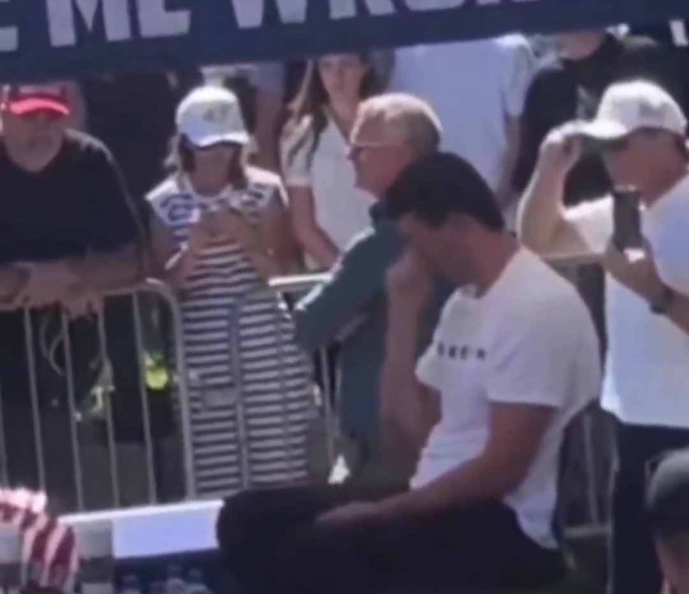

# PsyOp Evaluation Report – [ The "Assasination" of Charlie Kirk ]
## 20250916
### Prepared by:
  - yung-megafone

---

## 1. Publication & Narrative Pre-Seeding  
**Precedence: Highest | Contribution Score: 10/10**  

### 1.1 Book Anomaly (Fig. 1.1)  
- Book listed as published **Sept 9, 2025** - one day before the event.[^1]  

- KDP requires ~72 hrs review, publishing date set as the day Amazon authorizes the publication → manuscript must have been submitted on or before Sept 9.[^2]  
- At **12:26 PM Sept 10 MDT**, no time zones were still on Sept 9.[^3] 
- Instead of correction, Amazon/Google **scrubbed the book and companion piece**.  

> Clear narrative pre-seeding.  

---

## 2. Ballistics & Forensic Evidence  
**Precedence: 2nd Highest | Contribution Score: 10/10**  

### 2.1 Mass Crowd Non-Reaction (Fig. 2.1a)  
- **Thousands in attendance**; majority remained facing forward.  

- Minimal flinching; reaction delay ~1-2 seconds after shot.  
- Real gunfire → *instant chaos* (.3-.5s jerk reaction)[^10] [^11]

> Indicates a suppressed shot/edited audio, **or stage-managed reaction** rather than a candid shooting.  

### 2.2 Second Armed Individual (Fig. 2.2a)  
- Cellphone footage: man fleeing with handgun drawn in right hand.  

- Never acknowledged in official reports.  

> This directly undermines the “lone gunman” narrative.  

### 2.3 Rifle Problem (Fig. 2.3a–e)  
- Suspect seen only with backpack; never with rifle.  
- Bolt-action with scope (~40+ in.) allegedly found.

- Scope improperly mounted.  (see fig. 2.3a)

- Stairwell stills (2.3b-2.3c) show **normal knee flexion** → impossible with barrel concealed. 

 

> The rifle was likely **planted for symbolism**, not used.  

### 2.4 Blood & Trauma Anomalies (Fig. 2.4a–d)  
- Pre-Shot

- Shirt flared upward pre-blood (squib-like effect). [^7] [^8] [^9]

- Blood flow: hose-like, not an arterial spray.  

- No mist, no backdrop spray, no exit chaos. 

- Wound size seems too large for an entry, yet too small for an exit - energy transfer would indicate it to be an entry, yet there is no exit

> Visuals appear more consistent with **stage blood effects**.  

### 2.5 Exit Wound Absence (Fig. 2.5)  
- No reports or images of exit wound.  
- High-velocity rifle → catastrophic exit unavoidable.

> Major forensic omission.  

### 2.6 Audio Observation (Fig. 2.6a–b)  
- Crowd recordings resemble a sharp, firecracker-like pop.  
- Distinct muzzle blast is not readily identifiable in the available clips.  
- This may represent the supersonic crack of the bullet, with the muzzle report diminished by acoustics, suppression, or microphone filtering.  

### 2.7 Rifle Logistics & Timing (Fig. 2.7a–e)

* Shooter allegedly scaled roof carrying a **full-length bolt-action rifle** (\~40+ in.) - with an attatched scope - unnoticed.

* Fired one shot, then supposedly:

  1. **Dismantled rifle** on rooftop.
  2. **Exited roof in 38 seconds.**
  3. Reassembled weapon in woods before “ditching” it.

* Forensic contradiction: the rifle was recovered with **round still chambered** → this weapon could *not* have been disassembled in that state as it requires removal of the bolt - which ejects the cartridge. [^15] [^16]

* Weight, bulk, and timing constraints make the official version implausible.

> Strong evidence weapon was **planted as a prop** or moved post-event, not carried and fired by suspect as alleged.

---

## 3. Body Language & Crowd Behavior  
**Precedence: 3rd | Contribution Score: 9/10**  

### 3.1 Coordinated Signals (Fig. 3.1a–d) 
- Kirk scratches face seconds before.   

- White-hat man touches brim → sniper cue [^13] - or "watch", pay attention [^14].

- White-hat man brushes cheek  possible identifier.

- Second man notices, hesitates, appears to verify the backdrop is clear, then makes danger-arm gesture.

- Second man then taps arm. (possible execute signal)

- Shot fired within milliseconds - typical reaction time.  

>  Three synchronized signals.  

### 3.2 Crowd Dispersal (Fig. 3.2a)  
- Crowd scattered almost uniformly.  
- Real shootings: confusion → staggered chaos.  
(media/2.2b.mp4)

> Appears cued.  

### 3.3 Sole Speaking Witness (Fig. 3.3)  
- Only bystander testimony: man asking debate question (as of report date).  
- The phrasing (“including or excluding gang violence?”) framed the context seconds before shot. 

> At minimum, conveniently positioned.  

---

## 4. Witness & Narrative Management  
**Precedence: 4th | Contribution Score: 10/10**  

### 4.1 Witness Silence (Fig. 4.1a)  
- No organic testimony from crowd, medics, or security.  
- Friends/security “unavailable,” yet media reported “not involved.” 

> Narrative lockdown.  

### 4.2 Forensic Gaps (Fig. 4.2a–d)  
- Palm/forearm prints allegedly found, not matched.  
- No rifle-in-hand photos.  
- No casing/etching photos. 

> Absence where evidence should be strongest.  

#### 4.2d Stage Camera Removal  
- Camera allegedly removed from stage within 5 minutes of the shot.  
- Scene not yet secured, yet evidence removed.  

> Suggests deliberate **tampering/withholding of High Quality footage**.  

### 4.3 Rapid Renovations (Fig. 4.3)  
- Renovations began within a week of the event. 

- Scene was not preserved for forensic review.

> Consistent with **evidence suppression/scene management**. 

#### 4.4 Media Anomaly – Absence of Livestreams (Fig. 4.4a)

* TPUSA events are routinely livestreamed (official feeds + audience streams).
* **Sept 10 event:** No verified livestream footage exists; all circulating videos are low-quality **after-the-fact uploads.**
* Statistically abnormal for 2025, especially given student-heavy audience and TPUSA’s history of streaming AmericaFest, Student Action Summit, etc.
* Absence prevents open-source verification of timeline and audio-visual continuity.

> Suggests either **technical suppression** (jamming, restrictions) or **deliberate curation** (livestreams existed but scrubbed).

---

## 5. Political Context & Motive  
**Precedence: 5th | Contribution Score: 10/10**  

### 5.1 Epstein Files Vote (Fig. 5.1)  
- **Sept 10, 2025**: Senate voted 51–49 against [H.R.4405 - 119th Congress](https://www.congress.gov/bill/119th-congress/house-bill/4405) to keep Epstein files sealed.[^4] [^5]
- The Kirk event dominated headlines → buried Epstein coverage.

> Clear **distraction utility**.  

### 5.2 Shooter Profile as Fall Guy (Fig. 5.2a–b)  
- Shooter allegedly lived with transgender partner (polarizing). [^12] 
- Detained 33 hrs later.  
- Initially “confessed,” later recanted.  

> Profile engineered for division.  

---

## 📊 Category Scoring Summary  

| Category                        | Score (1–10) | Weight | Notes                                |  
|---------------------------------|--------------|--------|--------------------------------------|  
| Publication & Pre-Seeding        | 10           | High   | Book anomaly = strongest flag.       |  
| Ballistics & Forensics           | 10           | High   | Contradictions dismantle lone-gunman. |  
| Body Language & Crowd Behavior   | 9            | Med    | Signals + dispersal inconsistent.    |  
| Witness & Narrative Management   | 10          | Med    | Lockdown + evidence removal/renovation. |  
| Political Context & Motive       | 10           | High   | Distraction value undeniable.        |  

---

## 🧮 Composite PsyOp Score  
- **Initial Read:** 7/10 (early anomalies).  
- **Updated with crowd + second gunman:** 9.6/10.  
- **Composite Weighted Average:** ≈ 9.6/10.   

---

## ⚖️ Final Takeaway  
This event aligns with the **state-managed lone gunman playbook** (JFK, RFK, MLK):  

- Symbolic bolt-action rifle.  
- Missing/conflicting forensic evidence.  
- Stage-managed trauma visuals.  
- Crowd & witness behavior inconsistent with reality.  
- Political timing perfectly burying a major scandal.  

👉 **Conclusion:** Near-certainty of PsyOp, either a **real shooting with curated cover-up** or a **staged spectacle with controlled footage**. The official narrative fails basic forensic and procedural scrutiny.  

---

[^1]: [The Shooting of Charlie Kirk - Anastasia J. Casey](https://archive.ph/1VLF3#selection-6123.0-6127.17) 

[^2]: [KDP Publishing Timelines – Amazon](https://kdp.amazon.com/en_US/help/topic/G202173620)  

[^3]: [Time Zone Map – timeanddate.com](https://www.timeanddate.com/time/map/#!cities=2128)  

[^4]: [U.S. Senate Roll Call Vote 512 – Motion to Table Schumer Amendment No. 3849](https://www.senate.gov/legislative/LIS/roll_call_votes/vote1191/vote_119_1_00512.htm)  

[^5]: [AP News – Senate Republicans narrowly reject Schumer bid to force release of Epstein files](https://apnews.com/article/1793c4c1c2f74f89b0cab9ecfd0cfcc8)  

[^6]: [The effect of military clothing on gunshot wounding (PMC)](https://pmc.ncbi.nlm.nih.gov/articles/PMC6570663/)  

[^7]: [Clothing increases the risk of indirect ballistic fractures (PMC)](https://pmc.ncbi.nlm.nih.gov/articles/PMC4222043/)  

[^8]: [Air-Powered Blood Squibs – No Film School](https://nofilmschool.com/2017/06/watch-learn-how-make-air-powered-blood-squibs-gunshot-effects)  

[^9]: [Theatrical Blood Effects – MilitaryMoulage.com](https://www.healthysimulation.com/theatrical-blood-effects-part-4-from-militarymoulage-com/)  

[^10]: [Startle Response Latency – ScienceDirect](https://www.sciencedirect.com/topics/neuroscience/startle-response)  

[^11]: [Prepulse Inhibition of the Auditory Startle Reflex – MDPI](https://www.mdpi.com/2076-3425/10/9/639)  

[^12]: [Sources: Kirk investigators: "Aghast" transgender roommate may lead to motive – Axios](https://www.axios.com/2025/09/13/kirk-suspect-transgender-roommate)

[^13]: [Military Hand Signals – Colemans](https://colemans.com/surplus-guide/post/military-hand-signals)

[^14]: [Tactical Hand Signals](https://www.scribd.com/document/18406684/Tactical-Hand-Signals)

[^15]: [Mauser K98k/M98 Part 1: Disassembly (YouTube)](https://www.youtube.com/watch?v=YN8Eq2FmYvQ)

[^16]: [Assembly And Disassembly Guide For The Mauser 98k & M48](https://www.brownells.com/gear/books-videos/books/mauser-98k--m48-assembly-and-disassembly-guide/)